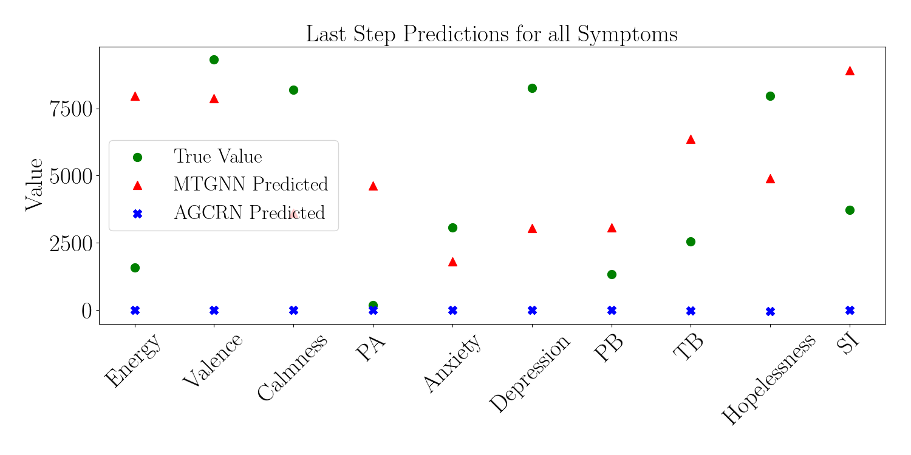
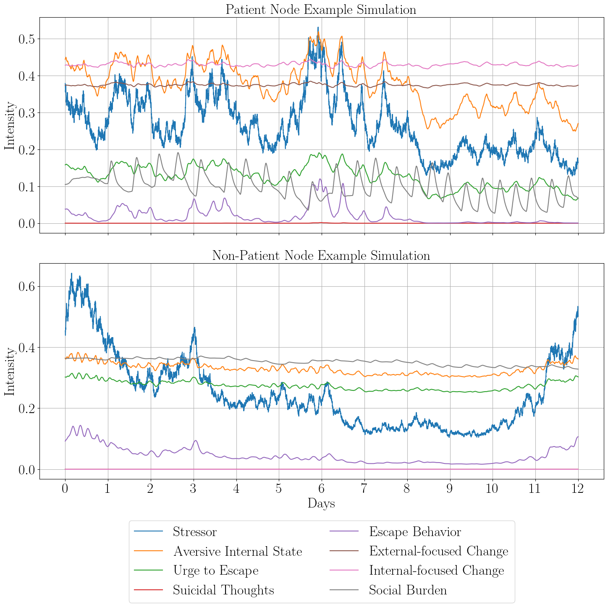

# Engels-CLS-Thesis
A repository for the code used to carry out my thesis is Computational Science at the UvA.
This thesis consists of two parts: one relating to data-driven machine learning and another based on 
theoretical mathematical modeling of suicide. In the data-driven machine learning section, we use GNNs to explore their capabilities with next-step prediction of symptoms related to suicidality. We also perform some risk-based clustering.

## Data-driven Section
The data necessary to reproduce these results is available upon request to thomas.forkmann@uni-due.de. The original study from the data collection is summarized in the following paper.

Thomas Forkmann et al. “Assessing suicidality in real time: A psychometric evaluation of self-report items for the assessment of suicidal ideation and its proximal risk factors using ecological momentary assessments.” In: Journal of Abnormal Psychology 127.8 (Nov. 2018), pp. 758–769. issn: 0021-843X. doi: 10.1037/abn0000381.

Given that the data is unavailable, the scripts are provided with 'data.csv' placeholders. However, 
given new data, and with adjustment of the column names/symptoms of interest, the scripts are still useful.

### Features
1. **Process Data**
    - The script for data splitting and normalization for the GNNs.

2. **AGCRN and MTGNN**  
    - Both scripts set up their respective GNNs and collect their data.

3. **Clustering**
    - The script for performing the clustering. Here we have the capability of setting specific feature-based clustering or using a grid-search to find the best combinations of features.

4. **Plot**
    - A script for visualizing the results of the GNNs and analyzing their performance.

5. **Graph Vis**
    - A script for visualizing the learned graphs from the MTGNN.

6. **Plots**
    - A folder for the results of the GNN performance and clustering. 

## Formal Modeling Section
Here, we extended the model described in Wang et al. (2023) to include social factors as well. The reference for the original pre-print is found below.

Shirley B Wang et al. Mathematical and Computational Modeling of Suicide as a
Complex Dynamical System. Sept. 2023. doi: 10.31234/osf.io/b29cs.

### Features
1. **Wang Model**
    - The adjusted model from Wang et al. (2023), with the added parameters from the social extension.

2. **Network Suicide**  
    -  A script for setting up the varying social configurations with which to simulate the model on.

3. **Experiments**
    - The script for doing parameter sweeps and various experiments within the social configurations.

4. **Plots**
    - A folder with all of the plots available in the thesis.

5. **Sweep Results**
    - A folder for the results from the various newly added parameter sweeps.

6. **Social Configurations**
    - A folder to hold the results from the experiments with the different social configurations.